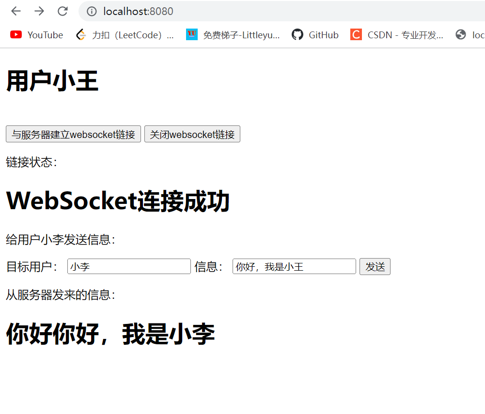

# 一 什么是WebSocket

## **1.1 首先分清几个概念**

- **http协议：**超文本传输协议，属于应用层。它的任务是与服务器交换信息。至于怎么连接到服务器，怎么保证数据正确，http不管。

- **TCP协议：**传输控制协议，属于传输层。任务是保证连接的可靠，包括防止丢失，出错。所以在初次连接的时候进行3次握手，断开连接时进行4次挥手。至于连接上以后具体传送什么数据，tcp不管。

PS：别的应用层协议也能通过tcp进行，那么这协议在底层也进行三次握手。

## 1.2 混淆点

- **WebSocket**：基于TCP的，运行在应用层，替代`http`的一个协议。
- 网上说的`WebSocket`只有一次握手，指的是：客户端发送一个`http`请求到服务器，服务器响应后标志这个连接建立起来。而不是指`TCP`的三次握手。

## 1.3 优点

- 节约宽带。轮询服务端数据的方式，使用的是http协议，head的信息很大，有效数据占比低，而使用WebSocket，头信息很小，有效数据占比高。
- 无浪费。轮询方法可能轮询10次，才可能碰到服务端数据更新，那么前9次数据都浪费了。而WebSocket是由服务器主动发回，来的都是新数据。
- 实时性。当服务器完成协议升级后（HTTP->Websocket），服务端可以主动向客户端推送信息，省去了客户端发起请求的步骤，同时没有间隔时间，只要服务端内容有变化，就可以告知客户端。实时性大大提高。

# 二 Socket和WebSocket的区别

- 本质上：

  - `Socket`本身不是一个协议，而是一个调用接口（API)，它工作在OSI模型中的会话层（第5层），是对TCP/IP协议的封装。`websocket`运行在应用层，是http升级的一个协议。

    

- 连接：

  - `Socket`连接需要一对套接字，一个运行于客户端，另一个运行于服务端。连接分为三个步骤：服务器监听，客户端请求，连接确认。

    

  - `websocket`在客户端，发送一个http请求到服务器，当服务器响应后，完成协议升级，连接建立。

# 三 WebSocket服务端搭建

## 3.1 导入jar包

```xml
<dependency>
            <groupId>org.springframework.boot</groupId>
            <artifactId>spring-boot-starter-websocket</artifactId>
</dependency>
```

## 3.2 搭建websocket服务

- **WebSocketConfig**

  ```java
  package com.wyq.websocket.config;
  
  import org.springframework.context.annotation.Bean;
  import org.springframework.context.annotation.Configuration;
  import org.springframework.web.socket.server.standard.ServerEndpointExporter;
  
  /**
   * @ClassName WebSocketConfig
   * @Description: //TODO websocket配置类
   * @Author wyq
   * @Date 2022/5/5 17:39
   */
  @Configuration
  public class WebSocketConfig {
      /**
       * 这个Bean会自动注册使用@ServerEndpoint注解声明的websocket endpoint
       */
      @Bean
      public ServerEndpointExporter serverEndpointExporter(){
          return new ServerEndpointExporter();
      }
  }
  
  ```

- **WebSocketServer**

  用于接收客户端的`webSocket`请求，处理主要逻辑。代码如下：

  - @ServerEndpoint注解中写上客户端连接的地址。

  ```java
  package com.wyq.websocket.component;
  
  import cn.hutool.json.JSONObject;
  import org.springframework.stereotype.Component;
  
  import javax.websocket.*;
  import javax.websocket.server.PathParam;
  import javax.websocket.server.ServerEndpoint;
  import java.io.IOException;
  import java.util.Map;
  import java.util.concurrent.ConcurrentHashMap;
  
  /**
   * @ClassName WebSocketServer
   * @Description: //TODO
   * @Author wyq
   * @Date 2022/5/5 17:47
   * @ServerEndpoint 通过这个 spring boot 就可以知道你暴露出去的 websockst 应用的路径，有点类似我们经常用的@RequestMapping。比如你的启动端口是8080，而这个注解的值是ws，那我们就可以通过 ws://127.0.0.1:8080/websocket 来连接你的应用
   * @OnOpen 当 websocket 建立连接成功后会触发这个注解修饰的方法，注意它有一个 Session 参数
   * @OnClose 当 websocket 建立的连接断开后会触发这个注解修饰的方法，注意它有一个 Session 参数
   * @OnMessage 当客户端发送消息到服务端时，会触发这个注解修改的方法，它有一个 String 入参表明客户端传入的值
   * @OnError 当 websocket 建立连接时出现异常会触发这个注解修饰的方法，注意它有一个 Session 参数
   */
  @Component
  @ServerEndpoint("/webSocket/{username}")
  public class WebSocketServer {
      /**
       * concurrent包的线程安全Set，用来存放每个用户对应的Session对象。
       */
      private static Map<String, Session> clients = new ConcurrentHashMap<>();
  
      /**
       * 连接建立成功调用的方法
       */
      @OnOpen
      public void onOpen(@PathParam("username") String username, Session session) throws IOException {
          if (username == null) {
              return;
          }
          clients.put(username, session);
          System.out.println("用户：" + username + "已连接到websocke服务器");
      }
  
      /**
       * 连接关闭调用的方法
       */
      @OnClose
      public void onClose(@PathParam("username") String username) throws IOException {
          clients.remove(username);
          System.out.println("用户：" + username + "已离开websocket服务器");
      }
  
      /**
       * 收到客户端消息后调用的方法
       */
      @OnMessage
      public void onMessage(String json) throws IOException {
          System.out.println("前端发送的信息为：" + json);
          JSONObject jsonObject = new JSONObject(json);
          String user = jsonObject.getStr("user");
          String msg = jsonObject.getStr("msg");
          Session session = clients.get(user);
          //如果这个好友在线就直接发给他
          if (session != null) {
              sendMessageTo(msg,session);
          } else {
              System.out.println("对方不在线，对方名字为：" + user);
          }
      }
  
      /**
       * 出现异常触发的方法
       */
      @OnError
      public void onError(Session session, Throwable error) {
          error.printStackTrace();
      }
  
      /**
       * 单发给某人
       */
      public void sendMessageTo(String message, Session session) throws IOException {
          session.getBasicRemote().sendText(message);
      }
  }
  ```

## 3.3 第三方网站测试

- 在线测试网址

  > http://www.websocket-test.com/

- 连接url

  > ws://localhost:8080/webSocket/小王

- 建立、断开连接测试

  

- 模拟小王和小李通信

  - 小王给小李发

    > {"msg":"你好，我是小王","user":"小李"}

  - 小李收到后给小王发

    > {"msg":"你好你好，我是小李","user":"小王"}

  - 小王页面显示

    

  - 小李页面显示

    

# 四 客户端搭建

## 4.1 html页面

**index.html**

```html
<!DOCTYPE html>
<html lang="en">
<head>
    <script src="js/index.js" type="text/javascript"></script>
    <meta charset="UTF-8">
    <title>客户端</title>
    <base target="_blank">
</head>
<body>
<h1>用户小王</h1><br/>
<button onclick="buttonCreate()">与服务器建立websocket链接</button>
<button onclick="buttonClose()">关闭websocket链接</button>
<p>链接状态：</p>
<h1 id="status">未建立链接</h1>

<p>给用户小李发送信息：</p>
<form method="post" action="/server" target="nm_iframe">
    <label>目标用户：</label>
    <input name = "user" placeholder="请输入接收信息的用户名"/>
    <label>信息：</label>
    <input name = "msg" placeholder="请输入信息"/>
    <input type="submit" id="id_submit" name="nm_submit" value="发送" onclick="changeNum()"/>
</form>

<p>从服务器发来的信息：</p>
<h1 id="message"></h1>
</body>
</html>
```

## 4.2 js配置

**index.js**

```js
var websocket = null;

var host = document.location.host;

var username = "${loginUsername}"; // 获得当前登录人员的userName

// alert(username)

//判断当前浏览器是否支持WebSocket
if ('WebSocket' in window) {
    alert("浏览器支持Websocket")
    //假设当前用户是小王
    username = "小王";
    //alert(username);
    //alert('ws://'+host+'/webSocket/'+username);
} else {
    alert('当前浏览器 Not support websocket')
}


//将消息显示在网页上
function setMessageInnerHTML(innerHTML) {
    document.getElementById('message').innerHTML += innerHTML + '<br/>';
}

//建立websocket链接
function buttonCreate() {
    try {
        websocket = new WebSocket('ws://' + host + '/webSocket/' + username);
        initWebSocket();
    }catch (e){
        alert(e);
    }
}

//关闭websocket链接
function buttonClose() {
    try{
        websocket.close();
    }catch (e){
        alert(e)
    }
}

function initWebSocket() {

    //连接发生错误的回调方法
    websocket.onerror = function() {
        //alert("WebSocket连接发生错误")
        setMessageInnerHTML("WebSocket连接发生错误");

    };


    //连接成功建立的回调方法
    websocket.onopen = function() {
        //alert("WebSocket连接成功")
        changeStatus("WebSocket连接成功");
    }


    //接收到消息的回调方法
    websocket.onmessage = function(event) {
        //alert("这是后台推送的消息："+event.data);
        setMessageInnerHTML(event.data);
    }


    //连接关闭的回调方法
    websocket.onclose = function() {
        changeStatus("WebSocket连接关闭");
    }


    //监听窗口关闭事件，当窗口关闭时，主动去关闭websocket连接，防止连接还没断开就关闭窗口，server端会抛异常。
    window.onbeforeunload = function() {
        try {
            websocket.close();
        }catch (e){
            alert(e);
        }
    }
}

function changeStatus(text) {
    document.getElementById("status").innerText = text;
}
```

## 4.3 controller模拟信息发送

**ServerController.java**

```java
package com.wyq.websocket.controller;

import cn.hutool.json.JSONObject;
import com.wyq.websocket.component.WebSocketServer;
import org.springframework.web.bind.annotation.RequestMapping;
import org.springframework.web.bind.annotation.RequestMethod;
import org.springframework.web.bind.annotation.RestController;

import javax.servlet.http.HttpServletRequest;
import java.io.IOException;

/**
 * @ClassName ServerController
 * @Description: //TODO
 * @Author wyq
 * @Date 2022/5/5 17:59
 */
@RestController
public class ServerController {
    @RequestMapping(value = "/server", method = {RequestMethod.POST, RequestMethod.GET})
    public void server(HttpServletRequest request) throws IOException {
        try {
            String msg = request.getParameter("msg");
            String user = request.getParameter("user");
            //获取用户的webSocket对象
            WebSocketServer ws = new WebSocketServer();
            //封装JSON
            JSONObject jsonObject = new JSONObject();
            jsonObject.put("user", user);
            jsonObject.put("msg", msg);
            String message = jsonObject.toString();
            //发送消息
            ws.onMessage(message);
        } catch (Exception e) {
            System.out.println(e.toString());
        }
    }
}

```

## 4.4 运行测试

- 小王界面

  

- 小李界面

  

  # 五 源码下载

  github源码下载地址：

  > https://github.com/Ricardo0324/SpringBoot-WebSocket-Demo
